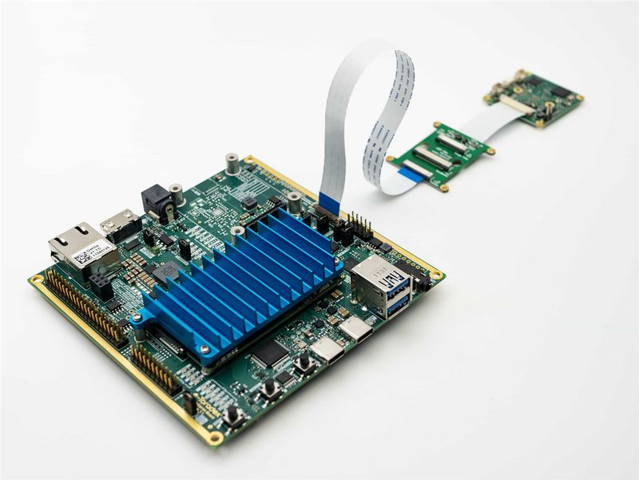
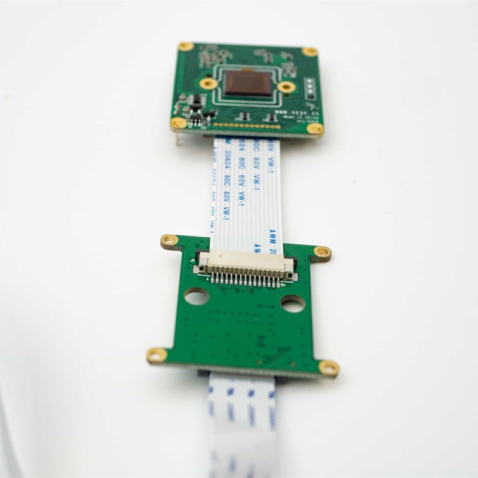
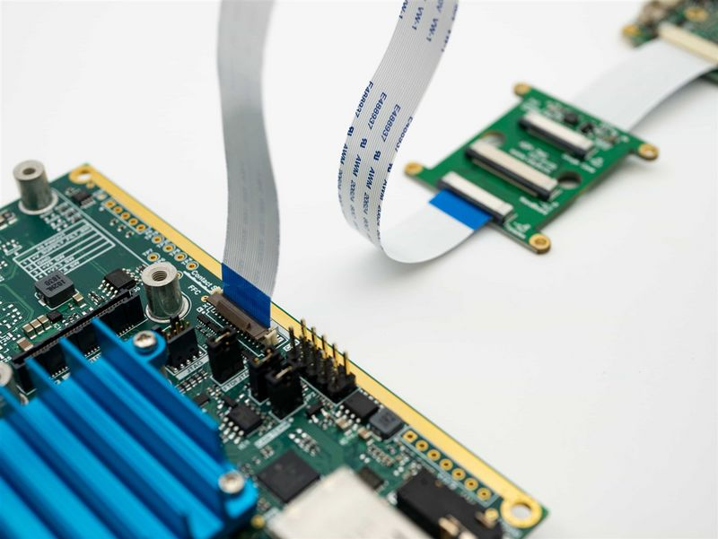

# VEYE Camera on Toradex i.MX8M Plus board
## Overview
iMX8M Plus is a system-on-chip (SoC) designed and manufactured by NXP Semiconductors. It is commonly used in a variety of applications such as smart home devices, industrial automation, digital signage, and automotive infotainment systems.

Verdin iMX8M Plus is a member of the Verdin Family designed by Toradex.

Dahlia is a compact carrier board providing easy access to the most common features of the Verdin family. A very convenient platform for software development and demonstration purposes, the board is compatible with all current and future Verdin SoMs.

We developed the driver using the Verdin iMX8M Plus + Dahlia carrier board as an example. In addition, we have also specifically designed an ADP-TWG adapter board for signal conversion.
In general, you only need to use the Image file that we provided. Of course, you can also modify or recompile the driver according to our open source code.
### Camera module list
| Series  | Model  | Status  | Adaptor board  |
| ------------ | ------------ | ------------ | ------------ |
| VEYE Series  | VEYE-MIPI-IMX327S  | Done  | ADP-TWG  |
| VEYE Series  | VEYE-MIPI-IMX462  | Done  | ADP-TWG  |
| VEYE Series  | VEYE-MIPI-IMX385  | Done  | ADP-TWG  |

VEYE and CS series camera modules are camera module with ISP functions build in. It output UYVYdata using MIPI-CSI2. We provide V4L2 interface for video streaming apps , and Video Control Toolkits (which is Shell Script) to control the camera module directly, which is called DRA(Directly Register Access).

## Hardware Setup
We use ADP-TWG to connnect camera to Dahlia board.
### Connection overview

### Connection of VEYE Camera and ADP-TWG
The two are connected using 1.0 mm pitch*15P FFC cable with opposite direction. The cable must be inserted with the silver contacts facing outside.

### Connection with Toradex Dahlia board with ADP-TWG
The two are connected using 0.5 mm pitch*24P FFC cable with same direction. The cable must be inserted with the silver contacts facing inside.


## Burn Verdin i.MX8M Plus system
Toradex provides various types of images for the board. Here, we only provide the "Toradex Embedded Linux - Yocto Project Reference Images” type of image for direct burning. If you want other types of burning images, please refer to the following chapter and compile and port the driver through the source code.
###  BSP package introduction
#### i.MX platform bsp
https://github.com/veyeimaging/nxp_i.mx_veye_bsp

includes：
- driver source code
- i2c toolkits
- application demo

#### Toradex i.MX platform bsp
https://github.com/veyeimaging/toradex_nxp_i.mx

includes：
- prebuild linux kernel：Image
- prebuild dtb for different boards
- dts source code
- the reference images are available in the release of this project.

### Burn the Image using Toradex Easy Installer
Download Image form here.

Refer to [loading-toradex-easy-installer](https://developer.toradex.com/easy-installer/toradex-easy-installer/loading-toradex-easy-installer#verdinsomfamily) article to burn the image to Verdin board.
### Necessary preparations
After burning, connect Dahlia's DEBUG port to the computer, and you can access the i.MX system via the serial port.
Enter username "root" and leave the password blank.

- Execute the following command to disable the boot animation:
systemctl stop wayland-app-launch
```
systemctl disable wayland-app-launch
reboot
```
## Applications and Test
### Check system status
Run the following command to confirm whether the camera is probed.

- VEYE-MIPI-IMX327S,VEYE-MIPI-IMX462,VEYE-MIPI-IMX385
`dmesg | grep veye`
The output message appears as shown below：
```
[    1.525383] veyecam2m 2-003b:  camera id is veyecam2m
[    1.533458] veyecam2m 2-003b: sensor is IMX327
[    1.537935] veyecam2m 2-003b: board type is ONE board
[    1.543320] veyecam2m 2-003b: veyecam2m camera probed
[    5.710340] mx8-img-md: Registered sensor subdevice: veyecam2m 2-003b (1)
[    5.757858] mx8-img-md: created link [veyecam2m 2-003b] => [mxc-mipi-csi2.0]
```
As you can see, the VEYE-MIPI-IMX327S module has been successfully probed and mounted on i2c-2.

- Run the following command to check the presence of video node.
`ls /dev/video*`
The output message appears as shown below.
`video3`

- List the formats supported by the camera
  `v4l2-ctl --list-formats-ext -d /dev/video3`
  ```
  ioctl: VIDIOC_ENUM_FMT

        Type: Video Capture Multiplanar

        [0]: 'RGBP' (16-bit RGB 5-6-5)

                Size: Discrete 1920x1080

        [1]: 'RGB3' (24-bit RGB 8-8-8)

                Size: Discrete 1920x1080

        [2]: 'BGR3' (24-bit BGR 8-8-8)

                Size: Discrete 1920x1080

        [3]: 'YUYV' (YUYV 4:2:2)

                Size: Discrete 1920x1080

        [4]: 'YUV4' (32-bit A/XYUV 8-8-8-8)

                Size: Discrete 1920x1080

        [5]: 'NV12' (Y/CbCr 4:2:0)

                Size: Discrete 1920x1080

        [6]: 'NM12' (Y/CbCr 4:2:0 (N-C))

                Size: Discrete 1920x1080

        [7]: 'YM24' (Planar YUV 4:4:4 (N-C))

                Size: Discrete 1920x1080

        [8]: 'XR24' (32-bit BGRX 8-8-8-8)

                Size: Discrete 1920x1080

        [9]: 'AR24' (32-bit BGRA 8-8-8-8)

                Size: Discrete 1920x1080
  ```
  In fact, the camera only provides UYVY data format, and the ISI module in i.MX 8M Plus provides data format conversion function, so /dev/video3 has so many output formats.

### Video Stream test
#### Preview (VEYE-MIPI-CAM@1080p mode)
`gst-launch-1.0 v4l2src device=/dev/video3 ! video/x-raw, format=NV12, width=1920, height=1080,framerate=30/1 ! autovideosink -v`
or
`gst-launch-1.0 v4l2src device=/dev/video3 io-mode=4 ! video/x-raw, format=NV12, width=1920, height=1080,framerate=30/1 ! imxvideoconvert_g2d ! queue ! video/x-raw, format=RGB16, width=1920, height=1080 ! waylandsink`

#### Snap a picture (VEYE-MIPI-CAM@1080p mode)
`gst-launch-1.0 v4l2src num-buffers=1 device=/dev/video3 ! 'video/x-raw, width=1920,height=1080' ! jpegenc ! filesink location=test_image.jpg`

#### Record 1080p video in H.264 format to a video file
`gst-launch-1.0 v4l2src device=/dev/video3 num-buffers=300 ! "video/x-raw,format=NV12, width=1920, height=1080" ! v4l2h264enc ! video/x-h264 ! h264parse ! qtmux  ! filesink location=filename.mp4 -e`

#### Playback of saved video file
`gst-launch-1.0 filesrc location=filename.mp4 ! queue ! decodebin ! videoconvert ! autovideosink`

### I2C Control Toolkits Manual
Because of the high degree of freedom of our camera parameters, we do not use V4L2 parameters to control, but use scripts to configure parameters.

https://github.com/veyeimaging/nxp_i.mx_veye_bsp/tree/main/i2c_cmd

Using -b option to identify which bus you want to use, please use -b 2 for Dahlia.

- VEYE series
Video Control Toolkits Manual ：[VEYE-MIPI-327 I2C](http://wiki.veye.cc/index.php/VEYE-MIPI-290/327_i2c/)

The "i2c_cmd" tool has already been provided in the /boot/ directory of the released image.

## Build the drivers from source
The following operations are done on Ubuntu Host PC.

Toradex provides a method for building the compilation system, and here we will provide an example that is feasible.

### Build Toradex standard Image
First, refer to the following article and use Yocto to compile the entire system.

[Build a Reference Image with Yocto Project/OpenEmbedded ](https://developer.toradex.com/linux-bsp/os-development/build-yocto/build-a-reference-image-with-yocto-projectopenembedded/)

This process is time-consuming, but by going through this process, you can recompile the entire system and avoid compatibility issues that may arise when modifying the original system.

After completing this step, you can use the Toradex Easy Installer to burn the Toradex standard image onto the board.

The compiled image can be found in the `oe-core/build/deploy/images/verdin-imx8mp` directory.

### Build the Image.gz
#### Patch driver code
`git clone https://github.com/veyeimaging/nxp_i.mx_veye_bsp.git`

The source code path of the camera driver is: `oe-core/build/tmp/work-shared/verdin-imx8mp/kernel-source/drivers/media/i2c`, places the source code of the camera driver in the corresponding directory.

Merge the Config and Makefile in the same path. Add the corresponding camera driver.

#### Add config option
`bitbake virtual/kernel menuconfig`

#### Build Image.gz
`bitbake virtual/kernel`

In the `oe-core/build/deploy/images/verdin-imx8mp` directory, you will obtain the Image.gz with added veye camera driver.

### Build the dtbo
#### Build Toradex standard dtbos
For the dtbo, I took a simpler approach. Refer to the following article to directly compile the dtbo, instead of using Yocto.

[Build Device Tree Overlays from Source Code](https://developer.toradex.com/linux-bsp/os-development/build-u-boot-and-linux-kernel-from-source-code/build-device-tree-overlays-from-source-code)

#### Add dts for veyecam
`git clone https://github.com/veyeimaging/toradex_nxp_i.mx.git`

#### Deploy Image.gz and dtbo
If you have already burned the Toradex standard image and compiled the `Image.gz` and `verdin-imx8mp_veyecam2m_overlay.dtbo`, you can simply follow the steps below to make them take effect:

1. Copy the compiled Image.gz file to the /boot/ directory and overwrite the original Image.gz file.
1. Copy the compiled verdin-imx8mp_veyecam2m_overlay.dtbo file to the /boot/overlay/ directory.
1. Modify the /boot/overlays.txt file to add verdin-imx8mp_veyecam2m_overlay.dtbo.
1. Restart the system to activate the new Image.gz and dtbo.

The above is just a brief approach. You can customize meta layers, recipes, and images in Yocto Project.

## References
- [Verdin iMX8M Plus](https://developer.toradex.com/hardware/verdin-som-family/modules/verdin-imx8m-plus/)
- [dahlia-carrier-board-kit](https://www.toradex.com/products/carrier-board/dahlia-carrier-board-kit)
- [Toradex Easy Installer](https://developer.toradex.com/easy-installer/toradex-easy-installer/loading-toradex-easy-installer#verdinsomfamily)
